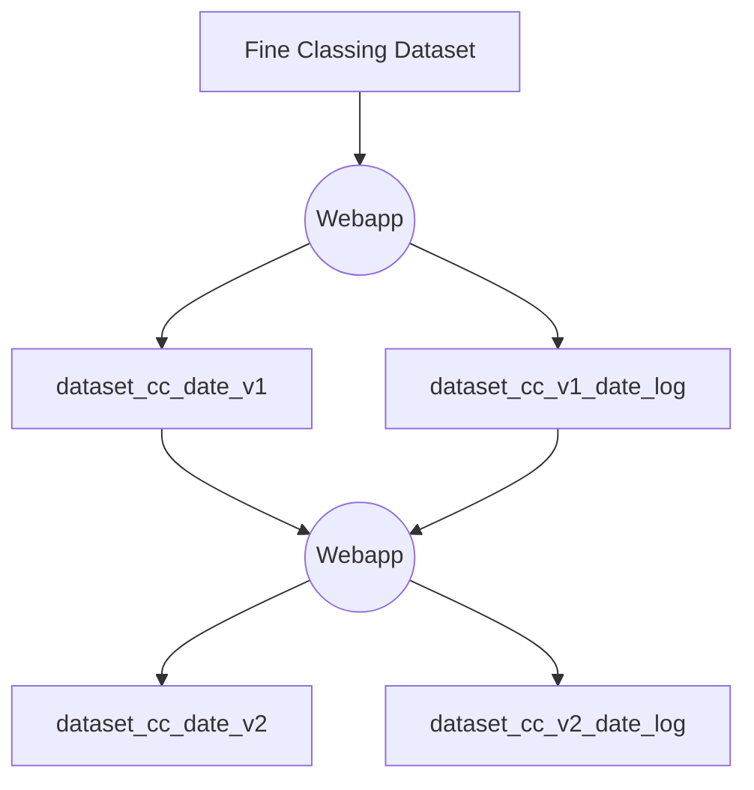

# Input

The input main dataset is in csv format stored in the *\<input_folder\>*

| Column Name               | Data Type | Description |
|---------------------------|-----------|-------------|
| variable                  | string    | The name of the variable being analyzed. |
| bin                       | string    | The bin or category of the variable. |
| group_id                  | integer    | Identifier for the group. |
| index_id                  | integer    | Identifier for the index. |
| train_good_count          | integer    | Count of good outcomes within the bin that belong to the training set. |
| train_bad_count           | integer    | Count of bad outcomes within the bin that belong in the training set. |
| train_factored_good_count | number    | Factored count of good outcomes within the bin that belong to the training set. |
| train_factored_bad_count  | number    | Factored count of bad outcomes within the bin that belong to the training set. |
| train_good%               | number    | Percentage of good outcomes within the bin that belong to the training set. |
| train_bad%                | number    | Percentage of bad outcomes within the bin that belong to the training set. |
| train_factored_good%      | number    | Factored percentage of good outcomes within the bin that belong to the training set. |
| train_factored_bad%       | number    | Factored percentage of bad outcomes within the bin that belong to the training set. |
| train_woe                 | number    | Weight of evidence of the bin belong to the training set. |
| train_mc                  | number    | MC of the bin belong to the training set. |
| test_good_count           | integer    | Count of good outcomes within the bin that belong to the test set. |
| test_bad_count            | integer    | Count of bad outcomes within the bin that belong to the test set. |
| test_factored_good_count  | number    | Factored count of good outcomes within the bin that belong to the test set. |
| test_factored_bad_count   | number    | Factored count of bad outcomes within the bin that belong to the test set. |
| test_good%                | number    | Percentage of good outcomes within the bin that belong to the test set. |
| test_bad%                 | number    | Percentage of bad outcomes within the bin that belong to the test set. |
| test_factored_good%       | number    | Factored percentage of good outcomes within the bin that belong to the test set. |
| test_factored_bad%        | number    | Factored percentage of bad outcomes within the bin that belong to the test set. |
| test_woe                  | number    | Weight of evidence of the bin belong to the test set. |
| test_mc                   | number    | Weight of evidence of the bin belong to the test set. |

# Output
Log file and version files are csv files stored in *\<output_folder\>* 
\* means the column may not be implemented.
## Log file
* Columns:
  
  | Column Name   | Data Type | Description                                      |
  |---------------|-----------|--------------------------------------------------|
  | changetime    | date      | Updated time                                     |
  | variable      | string    | Updated variable                                 |
  | bin           | string    | Updated bin                                      |
  | ori_group_id  | integer   | Group id before last edit                        |
  | new_group_id  | integer   | Updated group id in last edit                     |
  | versionfile   | string    | Version file name that stores the result of this change |
  | *username     | string    | User who edits the data                          |

* Filename:
    * Support customized filename, the file will be named in the format: *\<main_dataset\>\_cc\_\<YYYYMMDD\>_\<filename\>_log.csv*  
    cc: Stands for coarse classing  
    YYYYMMDD: Stands for current date

## Version file
* Columns: 
    | Column Name               | Data Type | Description |
    |---------------------------|-----------|-------------|
    | variable                  | string    | The name of the variable being analyzed. |
    | bin                       | string    | The bin or category of the variable. |
    | group_id                  | integer    | Identifier for the group. |
    | index_id                  | integer    | Identifier for the index. |
    | iv                        | number     | iv value of each variable. |

* Filename:   
    * Support customized filename, the file will be named in the format: *\<main_dataset\>\_cc\_\<YYYYMMDD\>_\<filename\>.csv*.  
    cc: Stands for coarse classing  
    YYYYMMDD: Stands for current date  

# Data Structure for Storing Main dataset, Version File and Editing Data

Use a global variable *working_state* to store data:  
```python
working_state = {
    'original_data': DataFrame,       # Original main data DataFrame
    'current_data': DataFrame,        # Loaded version file and current editing state DataFrame  
    'changes_history': [],       # List of change records in the current editing
    'changes_lasttime':[],       # List of change records in the last time
    'iv_ordred_list':[]          # List of IV values in decsending order
} 
```

The *changes_history* and *changes_lasttime* stores dict elements:
```python
change_record = {
    'changetime': date,         # When the change was made
    'variable': string,          # Variable name
    'bin': string,              # Bin value
    'old_group_id': integer,     # Previous group_id
    'new_group_id': integer,     # New group_id
}
```

The *iv_ordred_list* stores tuple elements:
```python
iv_record = (
    variable: string,          # Variable name
    iv: number,              # iv value
)
```

# Design of Data Selections 
Two dropdown selections:  
* Main Dataset
* Verion Log

## Values in Main Dataset Selection:
* A list of filenames in *\<input_folder\>*  
The selection will be prefilled with the filename you click on when activating the plugin.

## Values in Verion Log Selection:  
* Set a default null value option, because there may not exist log files.
* List of log files in *\<output_folder\>* ordered by date.


# Design of Initialization

## If the Verion Log selection is the default null option
```python
working_state = {
    'original_data': DataFrame,       # Original main data DataFrame
    'current_data': DataFrame,        # Variable,bin,group_id,index_id columns from main data DataFrame
    'changes_history': [],       # Empty
    'changes_lasttime':[],       # Empty
    'iv_ordred_list':[]          # Initialized from main data 
} 
```
Initialization of iv_ordred_list
```python
iv_ordred_list: [ (variable, sum(train_mc if group_id != 999)) ]

```

## If the Verion Log selection is not null  

Load the *versionfile* of the selected *log file*.

```python
working_state = {
    'original_data': DataFrame,       # Original main dataset DataFrame
    'current_data': DataFrame,        # Version file DataFrame
    'changes_history': [],       # Empty
    'changes_lasttime':[],       # Initialized from log file with changetime = largest(changetime)
    'iv_ordred_list':[]          # Initialized from main data and version file
}
```
 Initialization of iv_ordred_list
```python
iv_ordred_list: [ (variable, iv) ] # iv is loaded from version file
```

# Design of Statistics Calculation After Variable Selection
The situation for null version file is trivial. We only discuss the situation when version file is not null.

1. Filter main data DataFrame and version DataFrame by the variable name.
2. Use group_id in version DataFrame and original data in main data DataFrame to calculate the statistics

# Design of Updating Current Data After Editing Group ID
When we are editing the group ID, we must have chosen a variable. So we have filtered main data DataFrame  
and version DataFrame.

1. Update the content in Group table.
2. Update the group_id in working_state[\'current_data\'],  
    insert change_record into working_state[\'changes_history\']
3. Recalculate the statistics based on updated group_id and original data.

# Workflow of Updating Log Files and Version Files


dataset_cc_v2_date_log = Append dataset_cc_v1_date_log with 'changes_history'.