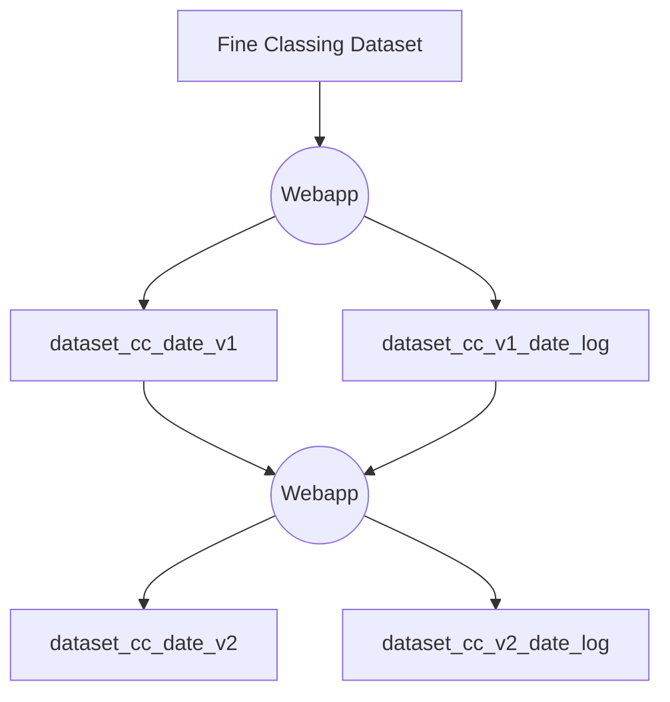

# NorthernArc Coarse Classing Webapp

## Input
The input section consists of two dropdown menus:
1. **Main Dataset**: Used to select which fine classing dataset to input.
2. **Version Log**: Used to choose a previously saved version to continue editing on.

## Viewing Last Group ID Update
After selecting a Version Log, you can click the "Last Time Update" button to view the group ID updates made in the last edit. The display format is as follows:

| Column Name      | Data Type | Description                              |
|------------------|-----------|------------------------------------------|
| changetime       | date      | Updated time                             |
| variable         | string    | Updated variable                         |
| bin              | string    | Updated bin                              |
| ori_group_id     | integer   | Group id before last edit                |
| new_group_id     | integer   | Updated group id in last edit            |
| username         | string    | User who edited the data                 |

## Editing Group ID
First, select the variable to edit through a dropdown menu. The variables in the value list are sorted by IV value in descending order.

Three tables are displayed on the page: Group Table, Statistics Table, and IV Table.

### Group Table
| Column Name      | Data Type |
|------------------|-----------|
| index_id         | integer   |
| group_id         | integer   |
| bin              | string    |

Coarse classing is achieved by editing the `group_id` in the Group Table.

**Note**: `group_id` 999 is special. If a bin's `group_id` is 999, it means that this bin's impact on the variable's IV is not considered. In other words, during the calculation of this variable's IV, the `mc` value of this bin is excluded.

### Statistics Table
1. Has the same structure as the Main Dataset, displaying real-time statistical data based on the `group_id` from the Group Table.
2. A summary row is added at the bottom of the table, showing the summary results for each statistical data item.
3. There is a dropdown button for filtering data displayed in the statistics table with values: train and test.  
  3.1. The columns: variable, bin, variable, group_id, index_id will always be displayed.  
  3.2. If select train, only display statistics related to training data, for example, train_good_count, train_bad_count, train_mc, etc. If select test, only display statistics related to test data.
### IV Table
| Column Name      | Data Type |
|------------------|-----------|
| rank             | integer   |
| variable         | string    |
| IV               | number    |

This table displays the real-time ranking of variables based on their IV values.

## Updating and Saving Edit Results
- Click the **Update** button to save the current updated `group_id`. If you switch variables without clicking the Update button, the updates to `group_id` will be lost.
- Click the **Save** button to output the Log file and Version file. You can input a customized filename. The format of the saved filenames is:
  - *\<main_dataset\>\_cc\_\<YYYYMMDD\>_\<filename\>_log.csv*
  - *\<main_dataset\>\_cc\_\<YYYYMMDD\>_\<filename\>.csv*

## Workflow of Version Iteration
